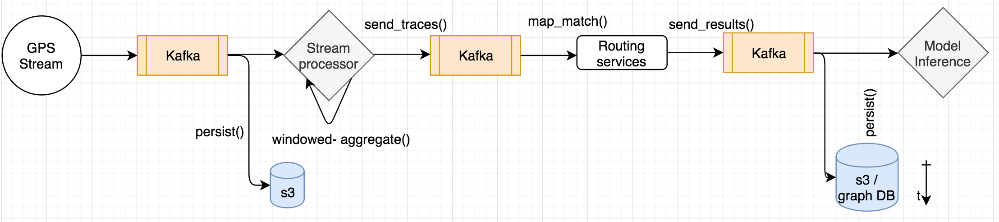

# Overview
A data pipeline over Kafka for processing GPS streaming data. There are major components:
1. a (simulating) producer that generates GPS data in the basic format of <vehicleID, lon, lat, timestamp>
2. a stream processor topology that aggregates GPS data by vehicleID in every pre-defined time window to form a GPS ``trace''
3. an OSRM instance receives ``traces'' and perform map-matching
4. a traffic model component that receives the map-matched data, creates a (near) real-time traffice graph and send to a persistence storage (aka. write to disks)


The figures below illustate the data pipeline at **Online** mode and **Offline** mode. Disclaimer: offline mode here is not necessarily 'training mode' of 
the traffic model.

## Online mode


Online mode diagram demonstrates the ingestion pipeline of GPS data in stream / real-time. The training process of the traffic model is an acsynchronous process. 
Specifically, at first, GPS data is sent / serialized into Kafka from the external provider (e.g., MyTaxi). Then it is sent to a stream processor (Kafka Stream 
in the current version) for doing `windowed aggregation / sampling` to form the "traces" of the vehicle. The window aggregation also allows data to come late in 
a certain (definable) lagging period for fault-tolerance. These `traces' information is then sent to a **routing 
service** instance (e.g., OSRM) for map-matching. The map-matching results (which returned the from-to-speed information) is then used by the traffic model for 
training / inference.

The map-matched data, in the basic form of "<vec_id, time_window, trace_metadata>" are stored in a DB table with the composite IDs of 
<vec_id, time_window>. This allows data to be re-map matched in case of failing at the stream mode.

## Offline mode


For offline mode, it is specifically for handling the scenario when the **base map is changed** - that is supposed to be a periodical behavior of base map providers 
(i.e., HERE, Civil Map, OSM). The change of the base map does not (yet?) preserve the IDs (nodes, edges) of the previous version. In this case, the historical 
map-matched data is obsoleted and becomes invalid with the new base map. Thus the historical GPS data will need to be re-map matched (in batch mode) to be ingested 
into the traffic model for re-training / inference. In this case, with this design, the routing service 
is in `pending mode`, and will wait for the whole process to be finished to be fed again with up-to-date traffic prediction.


# Kubenetes Setup and Configuration

For the pipeline, we design two major containers (`aggregator` for stream processor and `consumer` for interacting with a running routing service). The other containers 
will persist the Kafka data to s3 / DB. The traffic model component will be in a separate project (thus a separate pod).


## Dev

### Prerequisites:

* Install Java 8 and Maven 3
* You may need to set your `JAVA_HOME`.
* Compile with:
```bash
# Compile and run
mvn compile install
mvn -q exec:java -Dexec.args="your-bucket-name"
```
 
    

## Docker 🐳

`docker-compose up -d --build` to start and `docker-compose down` to stop.


TODO..